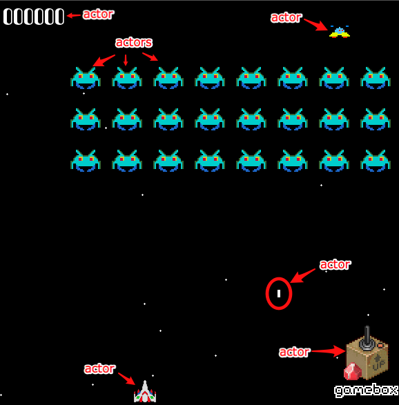

!SLIDE
# What are games? #
# fun interactions w/ sounds and graphics #

!SLIDE
# They aren't easy #

!SLIDE
# Game Loop #
	@@@ ruby
	while game_running?
	  # get user input
	  # run AI
	  # move everything
	  # resolve collisions
	  # draw graphics
	  # play sounds
	  # manage framerate
	end

!SLIDE bullets
# Messy and hard to test #

* Update methods with thousands of lines of code
* Draw methods with thousands of lines of code
* Crazy input handling
	
!SLIDE
# A better way #

!SLIDE center

# SDL + Rubygame + Gamebox #

!SLIDE

# SDL #
# push those low-level bits #

!SLIDE

# Rubygame #
# lets ruby talk to SDL #
## "John Croisant" <jacius@gmail.com> ##
## rubygame.org ##

!SLIDE

# Gamebox #
# lets your brain talk to ruby #
## http://github.com/shawn42/gamebox ##

!SLIDE bullets incremental
# Gamebox Goals #

* New game up and running quickly
* Allow for clear DSL
* DRY: prebuilt objects and behaviors
* Helpful, not in the way
* Testable

!SLIDE bullets incremental

# Gamebox Concepts #

* Lights, Camera, Action!
* Every object in a game is an Actor
* Actors have Behaviors
* Actors exist on a Stage
* Actors do NOT draw, ActorViews do

!SLIDE center

!SLIDE center

!SLIDE center
